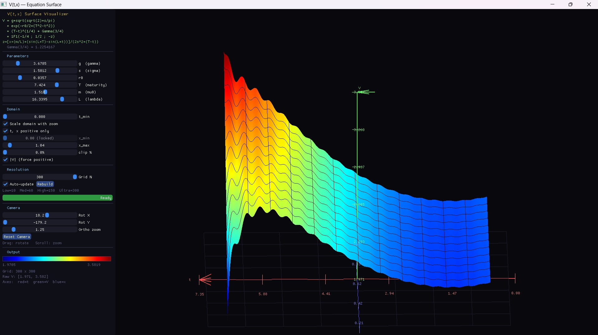
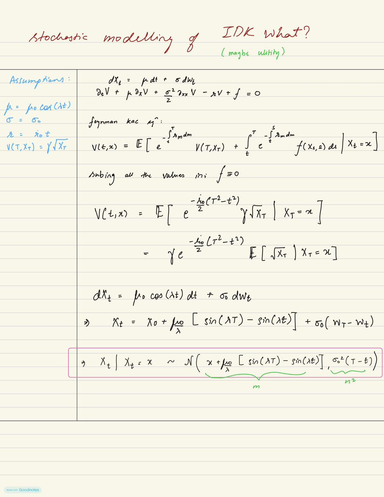
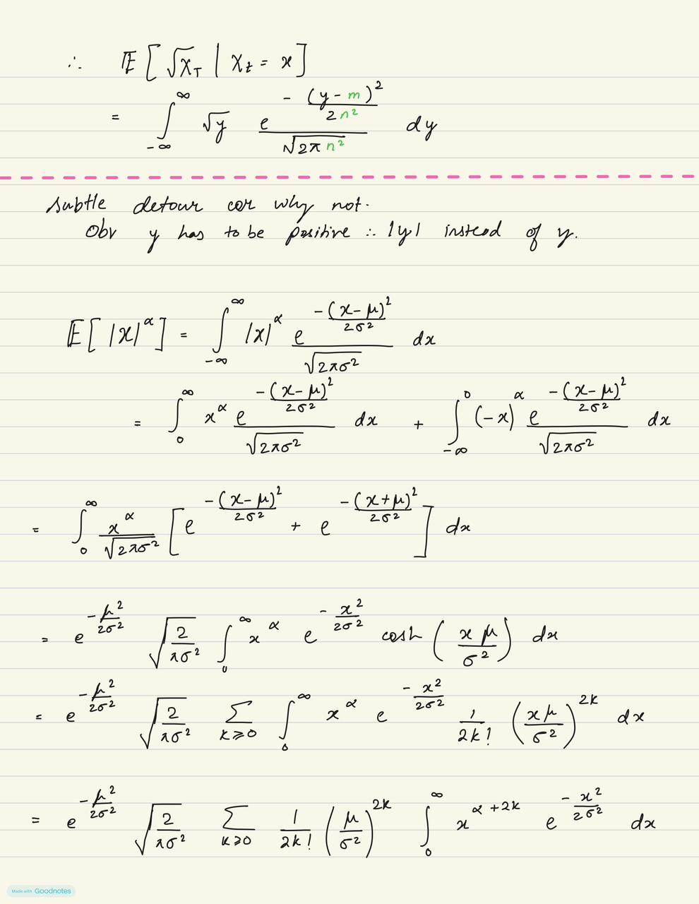
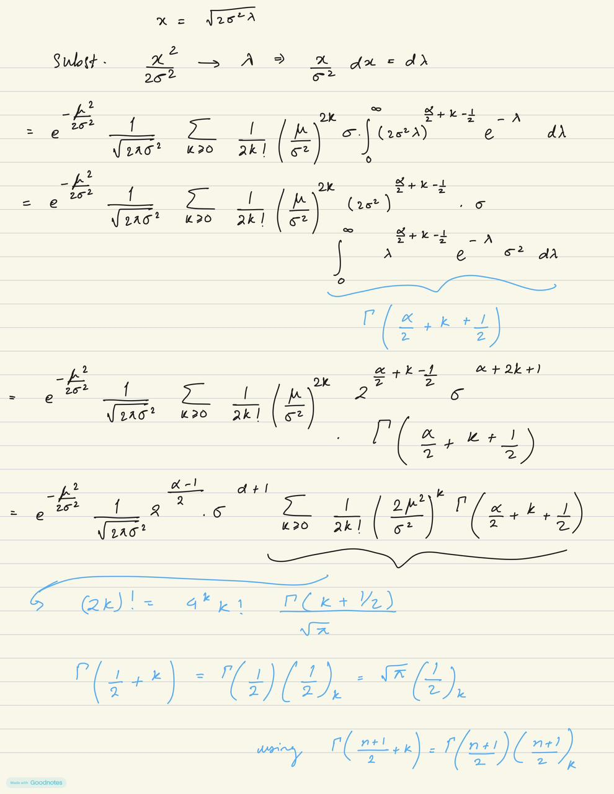
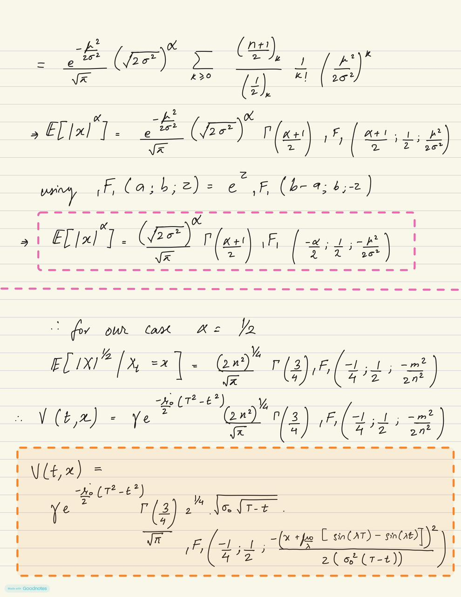

# V(t,x) Surface Visualizer

A real-time interactive 3D visualizer for a stochastic utility pricing equation solved analytically via Feynman–Kac and confluent hypergeometric functions.



---

## The Equation

$$V(t,x) = \gamma \sqrt{\frac{\sqrt{2}\,\sigma}{\pi}} \cdot e^{-\frac{r_0}{2}(T^2 - t^2)} \cdot (T-t)^{1/4} \cdot \Gamma\!\left(\tfrac{3}{4}\right) \cdot {}_1F_1\!\left(-\tfrac{1}{4};\,\tfrac{1}{2};\,-z\right)$$

$$z = \frac{x + \dfrac{\mu_0}{\lambda}\bigl(\sin(\lambda T) - \sin(\lambda t)\bigr)}{2\sigma^2(T-t)}$$

| Symbol | Meaning |
|--------|---------|
| γ | amplitude / utility scale |
| σ | volatility |
| r₀ | discount rate |
| T | maturity |
| μ₀ | drift amplitude |
| λ | drift oscillation frequency |
| t ∈ [0, T) | time (t-axis) |
| x | log-price / state variable (x-axis) |

---

## What does V(t,x) represent?

V(t,x) is the **fair value at time t** of a contract that pays **γ√X_T at maturity T**, where the underlying X_t follows an SDE with oscillatory drift:

$$dX_t = \mu_0\cos(\lambda t)\,dt + \sigma\,dW_t$$

The key steps:

1. **Feynman–Kac** converts the pricing PDE into an expectation:
$$V(t,x) = \gamma\, e^{-\frac{r_0}{2}(T^2-t^2)}\;\mathbb{E}\!\left[\sqrt{X_T}\;\middle|\;X_t = x\right]$$

2. **Conditional distribution** of X_T | X_t = x is Gaussian with mean $x + \frac{\mu_0}{\lambda}[\sin(\lambda T)-\sin(\lambda t)]$ and variance $\sigma^2(T-t)$.

3. **E[|X|^{1/2}] for a Gaussian** evaluates to ${}_1F_1(-\frac{1}{4};\frac{1}{2};-z)$, the Kummer confluent hypergeometric function.

### Derivation (handwritten)

| Page | Content |
|------|---------|
|  | SDE setup, Feynman–Kac PDE, conditional distribution of X_T |
|  | Computing E[√X_T] as a Gaussian integral, splitting into |x|^α |
|  | Substitution → Gamma function identity |
|  | Final {}_1F_1 formula, α = ½ case, closed-form V(t,x) |

---

## Features

- **Live 3D surface** — jet colormap, triangle-strip mesh, sparse wireframe
- **All parameters interactive** — slider + typed input field side by side; changes rebuild on a background thread
- **Domain controls**
  - `t, x positive only` — lock x ≥ 0 for the positive quadrant
  - `Scale domain with zoom` — x range expands/contracts with scroll zoom
  - `|V| (force positive)` — take |V| everywhere
- **Camera** — drag to rotate, scroll to zoom, orthographic projection
- **4K export** — offscreen FBO render at 3840×2160 with axis tick labels and parameters baked in; saves `.bmp` + `.csv`
- **Progress bar** — background compute progress; auto-queues if params change during compute

---

## Quick Start

### Prerequisites

- Windows 10/11
- [MSYS2 / MinGW](https://www.msys2.org/) with `ucrt64` toolchain
- CMake ≥ 4.0

```powershell
# Install MinGW toolchain (if not already installed)
# Open MSYS2 terminal and run:
#   pacman -S mingw-w64-ucrt-x86_64-gcc mingw-w64-ucrt-x86_64-cmake
```

### Build

```powershell
git clone https://github.com/Vedanggotmare/v-surface-visualizer.git
cd v-surface-visualizer

cmake -B build -G "MinGW Makefiles" -DCMAKE_BUILD_TYPE=Release `
      -DCMAKE_C_COMPILER="C:/msys64/ucrt64/bin/gcc.exe" `
      -DCMAKE_CXX_COMPILER="C:/msys64/ucrt64/bin/g++.exe"

cmake --build build --config Release -j4
```

First build auto-downloads GLFW 3.4 and Dear ImGui v1.91.6 (~30s). Subsequent builds take a few seconds.

### Run

```powershell
Start-Process -WorkingDirectory (Get-Location) .\build\V_surface.exe
```

> Run from the project directory so exports save there.

---

## Controls

| Input | Action |
|-------|--------|
| Left-click drag | Rotate |
| Scroll wheel | Zoom in/out |
| Slider | Sweep a parameter range |
| Input box (right of slider) | Type an exact value + Enter |
| Rebuild button | Force recompute (useful at high grid N) |
| Reset Camera | Restore default view angle |
| Export 4K BMP + CSV | Save 3840×2160 image + data grid |

**Tip:** Uncheck `Auto-update` before dragging the Grid N slider above 150 — it's expensive.

---

## Numerical Notes

- **₁F₁ implementation** — Kummer's confluent hypergeometric via power series for |z| ≤ 15, asymptotic expansion for z > 15. The series diverges catastrophically above z = 15 (catastrophic cancellation); this threshold is hard-coded.
- **Default x ∈ [−1.5, 1.5]** keeps z safely in the convergent regime. Widening x to ±3 can push z > 15 and produce exponentially large values that collapse the colormap.
- **Percentile clipping** (default 2%) removes outliers at domain edges before colormap normalization.
- **Γ(3/4) ≈ 1.2254167** — appears as a closed-form constant from the half-integer moment of the Gaussian.

---

## Export Format

Clicking **Export 4K BMP + CSV** renders offscreen at 3840×2160 and saves two files in the working directory:

```
V_surface_YYYYMMDD_HHMMSS.bmp   # lossless ~24 MB, axis labels + param box baked in
V_surface_YYYYMMDD_HHMMSS.csv   # t, x, V columns; param header comment
```

CSV example:
```
# g=1.000000 s=0.300000 r0=0.050000 T=1.000000 mu0=0.100000 lam=1.000000
t,x,V
0.000000,-1.500000,0.242813291
0.000000,-1.474576,0.248163104
...
```

---

## Dependencies

All fetched automatically by CMake:

| Library | Version | Purpose |
|---------|---------|---------|
| GLFW | 3.4 | Window + input |
| Dear ImGui | v1.91.6 | UI panel + widgets |
| OpenGL | 2.1 (legacy) | 3D rendering |

Windows GDI (built-in) is used for ClearType text in the 4K export.

---

## File Structure

```
v-surface-visualizer/
├── V_surface.cpp      # Everything: math, rendering, UI, export
├── CMakeLists.txt     # Build; auto-fetches deps
├── assets/
│   ├── preview.jpg            # Screenshot
│   ├── deriv_1_setup.jpeg     # Handwritten derivation p.1
│   ├── deriv_2_gaussian.jpeg  # Handwritten derivation p.2
│   ├── deriv_3_substitution.jpeg
│   └── deriv_4_result.jpeg
└── build/
    └── V_surface.exe  # Compiled binary (not tracked)
```

---

## Background

This equation arises naturally when pricing a **square-root utility contract** under a GBM-like process with oscillatory drift. The oscillatory term μ₀cos(λt) in the SDE produces the sin(λT) − sin(λt) shift in the argument of ₁F₁, giving the surface its distinctive ridge-and-valley structure as λ is varied.

The visualizer was built to explore how the surface geometry responds to changes in each parameter in real time — something that would be opaque from the closed form alone.
